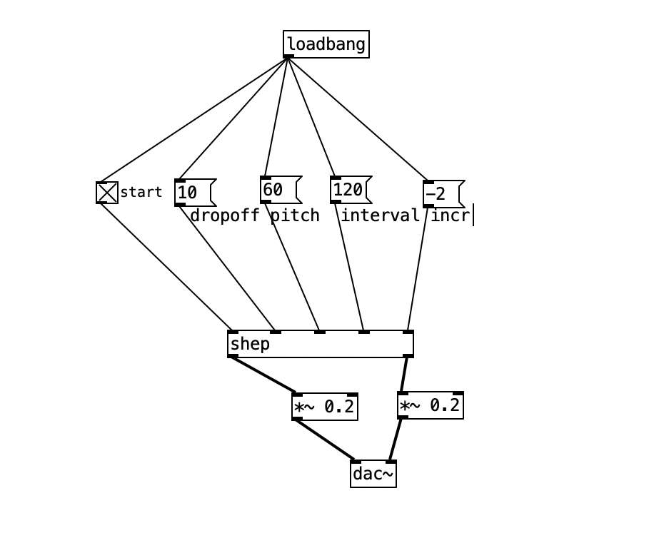
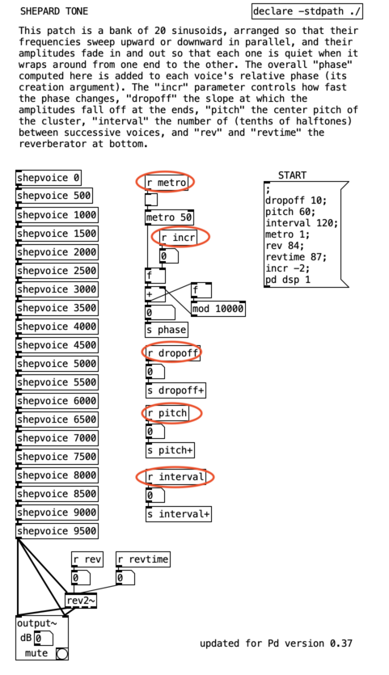
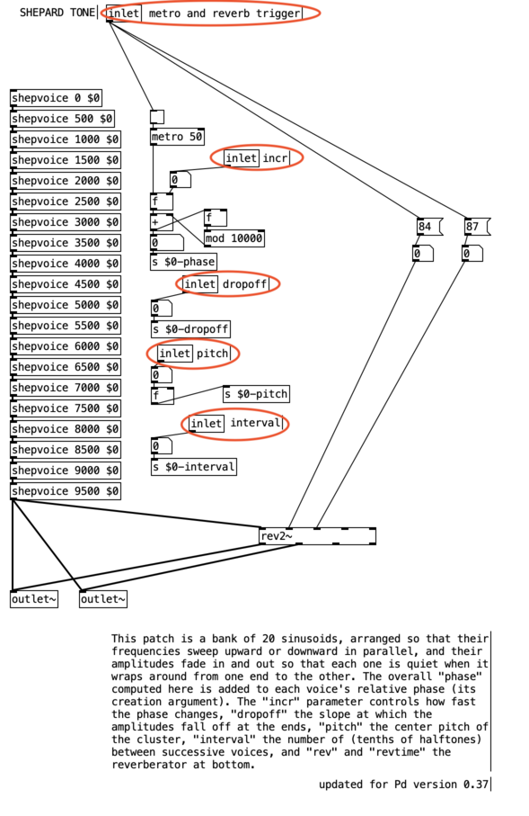
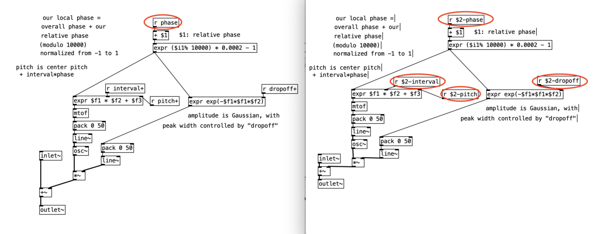

# Stealing a patch from the puredata examples.

In order to illustrate how to create a new patch we will convert the patch `D09.shepard.tone.pd` into a fully functional orac patch in such a way that we can run multiple independent instances of the patch in orac.  This is a multi-step process:

## Step 1.  Identify the patch parameters.

So first up we want to grab the example from puredata's documentation.  There are two files - `D09.shepard.tone.pd` and in the same folder `shepvoice.pd`.  While we're here we are going to rename the D09 file to `shep.pd`

-- commit here "add the shepard tone files"

## Step 2.  Identify the parameters.

Finding the parameters for this patch is easy.  These are all listed in the message box labeles `START` in the patch, as below:

    ;
    dropoff 10;
    pitch 60;
    interval 120;
    metro 1;
    rev 84;
    revtime 87;
    incr -2;
    pd dsp 1

Of these, `pd dsp` is not relevant to us.  With some fiddling I decided that the reverb - `rev` and `revtime` -   parameters do not need to be changed.

The `metro` parameter is just creating a trigger to start the patch's internal time keeping.

The remaining parameters are:

   dropoff
   pitch
   interval
   incr

What these do are described in the patch documentation.  Our job here is to rather than have the messages recieved from the start message box is to turn them into inlets.

## Step 3 - Inlets and outlets

This process is called turning the patch into an *abstraction*.  This part can be done on any computer with a display that can run puredata.  You don't need to use the organelle.

### Step 3a - test first!

The first rule of software development is to write the tests first (at the stage that nothing works).  I've made a [test.pd](./test.pd) file in this directory - screenshot below, in order to provide identical functionality to the original patch.

I'm no expert - a big part of the reason I'm writing this is to learn more about puredata and making sure I don't forget stuff when I learn it.  I'm sure there are other ways of achieving the following, but the below works for me

To start with I moved the example patch documentation out of the way to the bottom of the screen.

### Quickly deal with the outlets first

First it's easiest to deal with the outlets.  There are only two. I replaced the `output~` connections with two signal `outlet~` objects.  One for the left channel and one for the right.

### Dealing with the inlets

The inlets in the abstraction appear in the order that they are defined in the patch from left to right.  Below describes the inlets from left to right.  They're all control inlets

#### `metro` 

Next is the metronome signal - this is what gets the patch started.  So we change the `r metro` in the patch to a control `inlet` object.  This is expecting a trigger.  I don't think we need to have the trigger box before the metro in the patch but it's a useful indicator of what the inlet is expecting.

#### `dropoff`

I don't exactly understand what this parameter does but it's documented in the original patch.

### `pitch`

This is the centre pitch of the tone - what it's apparent note will be.  It's a midi note.

#### `interval`

This is the musical interval in cents between the highest and lowest tone 

#### `incr`

This is the rate at which the sound rises or falls.  Positive numbers result in a rise in pitch, drip a rise.  We don't have to worry about what these range of values is just yet.

The two images below show the patch highlighted before and after:

##### Before abstraction

##### After

|

# Steo 4.  Turning the patch into an abstraction

The original patch can only be run once.  Or more accurately you can run it any number of times simultaneously but they will all share the same parameter values.  You'll note that in the new patch there are a whole lot of uses of a variable `$0`.  Roughly speaking this translates to "the memory address of the current patch".  So all of the variables being sent (i.e. `pitch+` `dropoff+` etc) have been renamed to `$0-[name]`.  In addition to this each of the `shepvoice` instances all now have `$0` - the memory address of the current patch instance passed into the parameter.

So inside the shepvoice sub-abstraction, the memory address of the main patch is passed in as `$2`, so what was (for example) the variable `pitch+` is now `$2-pitch`.  This is showin in the screenshots below

# Step 5.  Done

So now we can use the test patch provided to check everything works.  And then proceed to the [integrating to orac](../02_integrating_to_orac/README.md).
