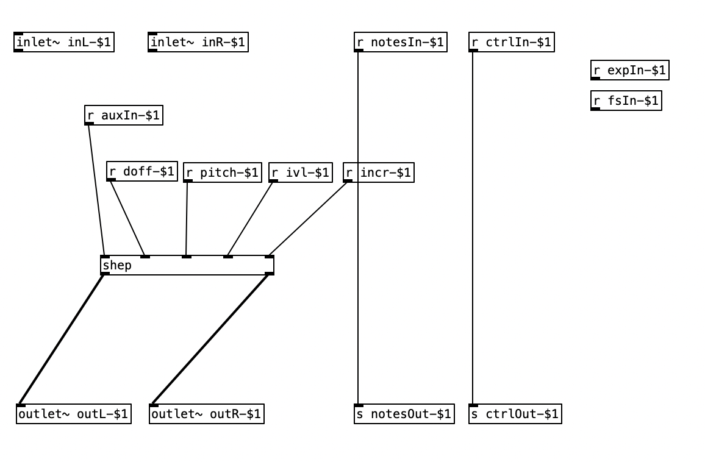

# Final re-integration of abstraction back to orac.

It's at this stage you are likely to want to be working on your organelle via VNC.

## Copy the files we need in.

First thing is to copy three files `deploy.sh` `module.json` and `module.pd`into this directory from the [basic paramaters](../00_basics_parameters/README.md) tutorial as well as the `shep.pd` and `shepvoice.pd` files from the [converting to an abstraction](../01_full_patch/README.md) tutorial.

## Modify module.json

From the previous tutorial our important paramesters are as below (with the data type and my best guess of the range in parentheses)

* dropoff (int - 1 to 40, default 10)
* pitch (int - 20 to 240, default 60)
* interval (int 20 to 240, defaul 120)
* incr (int -10 to +10, default -2)

The start parameter can be handled by the orac aux button, so we don't have to worry about that one yet.  It looks like the pitch parameter is midi note, but why that is is hidden in a formula in the ~shep.pd~ subpatch.  The modidified contents of `module.json` are below:

    {
        "display" : "Shepard tone",
        "parameters" :  [
            [ "int", "doff", "Dropoff", 1, 40, 10],
            [ "int", "pitch", "Pitch", 20, 240, 10],
            [ "int", "ivl", "Interval", 20, 240, 120],
            [ "int", "incr", "Increment", -10, 10, -2 ]
        ],
        "pages" : [
            ["pg_one","Page one", ["doff", "pitch", "ivl", "incr"]]
        ]
    }

##  Add the abstraction into the patch

This is pretty simple at this stage.  Add the shepard tone and put in the receive parameters we just defined:

At this point if we update orac on the organelle as described in the [first](../00_basics_parameters/README.md) everything should just work when we press the aux button.

## Distributing the patch

The patch contents are the `.pd` files, `module.json', and `deploy.sh`.

If we want to call the patch 'shepord' we rename this folder to `shepord`, move up one directory and:

  ~/scripts/create_install_package.sh shepord

Now reload storage, restart orac (select another patch then go back I guess) and try it out.
